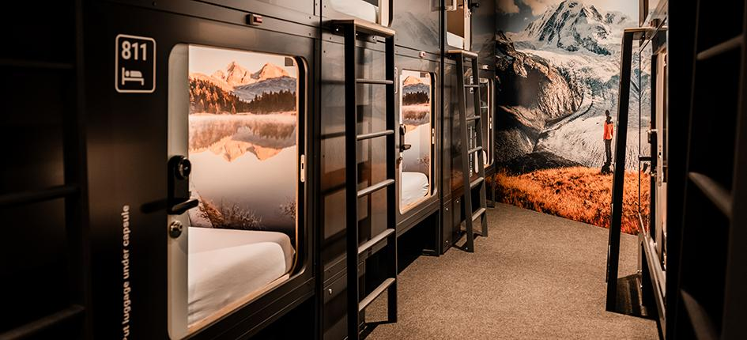

# ?? Kusirest - Sistema de Reservas de Cuartos



## ?? Descripción

**Kusirest** es una aplicación web completa y funcional que ofrece espacios de descanso por horas especialmente diseñados para estudiantes universitarios. El sistema incluye autenticación de usuarios, gestión de reservas, carrito de compras y historial completo.

## ? Características Principales

### ?? **Autenticación**
- **Usuario predefinido**: `kusi@gmail.com` / `kusi123`
- **Registro de nuevos usuarios** con almacenamiento local
- **Persistencia de sesión** entre visitas
- **Protección de rutas** para usuarios no autenticados

### ??? **Gestión de Cuartos**
- **12 cuartos disponibles** con diferentes características
- **Estados dinámicos**: Disponible, Ocupado
- **Tipos**: Normal (S/15) y Premium (S/20)
- **Servicios incluidos** por cuarto
- **Filtros avanzados**: Todos, Disponibles, Premium
- **Estadísticas en tiempo real**

### ?? **Sistema de Carrito**
- **Agregar/quitar cuartos** del carrito
- **Visualización del total** a pagar
- **Confirmación de reservas** con un clic
- **Validaciones** de disponibilidad

### ?? **Historial de Reservas**
- **Filtros por estado**: Todas, Activas, Completadas, Canceladas
- **Gestión completa**: Completar o cancelar reservas
- **Información detallada**: Fecha, hora, precio
- **Persistencia** en localStorage

### ?? **Diseño Moderno**
- **Colores corporativos**: Blanco y celeste (#00AEEF)
- **Diseño responsive** para todos los dispositivos
- **Animaciones suaves** y efectos hover
- **Iconografía con Font Awesome**

## ?? Funcionalidades

### **Página de Inicio**
- Hero section con call-to-action
- Información de la empresa (Misión y Visión)
- Formulario de contacto funcional
- Redes sociales

### **Sección Cuartos**
- Grid de cuartos con imágenes
- Filtros interactivos
- Sistema de reservas
- Estadísticas actualizadas

### **Historial**
- Vista completa de reservas
- Cambio de estados
- Filtros por estado
- Acciones por reserva

### **Autenticación**
- Modales de login/registro
- Validaciones de formulario
- Gestión de sesiones
- Interfaz adaptativa

## ??? Tecnologías Utilizadas

- **HTML5**: Estructura semántica
- **CSS3**: Diseño moderno con Grid y Flexbox
- **JavaScript Vanilla**: Lógica completa de la aplicación
- **LocalStorage**: Persistencia de datos
- **Font Awesome**: Iconografía
- **Google Fonts**: Tipografía Poppins

## ?? Estructura del Proyecto

```
KUSIREST/
??? index.html          # Página principal
??? styles.css     # Estilos CSS
??? script.js           # JavaScript funcional
??? assets/             # Recursos
?   ??? logo.png        # Logo de la empresa
?   ??? cuarto.jpg      # Imagen de cuartos
?   ??? inicio.jpg      # Imagen del hero
??? README.md           # Documentación
??? .gitignore  # Archivos ignorados
```

## ?? Instalación y Uso

### **Opción 1: Uso Local**
1. **Clona o descarga** el proyecto
2. **Abre** `index.html` en tu navegador
3. **¡Listo!** La aplicación funcionará completamente

### **Opción 2: Servidor Local**
```bash
# Con Python
python -m http.server 8000

# Con Node.js
npx serve .

# Con PHP
php -S localhost:8000
```

## ?? Despliegue en Azure

### **Azure Static Web Apps**
1. **Sube el proyecto** a GitHub
2. **Crea** un recurso "Static Web App" en Azure
3. **Conecta** con tu repositorio de GitHub
4. **Configura**:
   - App location: `/`
   - Api location: *(vacío)*
   - Output location: *(vacío)*

### **Azure App Service**
1. **Comprime** todos los archivos en un ZIP
2. **Crea** un App Service en Azure
3. **Sube** el ZIP usando el portal o CLI
4. **Tu aplicación** estará disponible inmediatamente

## ?? Usuarios de Prueba

### **Usuario Predefinido**
- **Email**: `kusi@gmail.com`
- **Contraseña**: `kusi123`
- **Nombre**: Usuario Kusirest

### **Registro de Nuevos Usuarios**
- Los usuarios registrados se guardan localmente
- Persistencia entre sesiones
- Validación de duplicados

## ?? Datos de Ejemplo

### **Cuartos Disponibles**
- **12 cuartos totales**
- **8 disponibles** inicialmente
- **4 ocupados** inicialmente
- **Tipos**: 7 normales (S/15) y 5 premium (S/20)

### **Servicios por Tipo**
- **Normal**: WiFi, Cama, TV, Aire Acondicionado, Enchufes
- **Premium**: WiFi, Cama King, TV Smart, Minibar, Jacuzzi, Suite

## ?? Flujo de Usuario

1. **Visita** la página de inicio
2. **Presiona** "Reservar cuarto"
3. **Inicia sesión** o regístrate
4. **Navega** a la sección Cuartos
5. **Filtra** y selecciona cuartos
6. **Agrega** cuartos al carrito
7. **Confirma** la reserva
8. **Gestiona** reservas en Historial

## ?? Características Técnicas

- ? **100% JavaScript Vanilla** (sin frameworks)
- ? **Persistencia de datos** con localStorage
- ? **Responsive design** completo
- ? **Navegación SPA** (Single Page Application)
- ? **Validaciones** de formularios
- ? **Gestión de estados** centralizada
- ? **Modales** interactivos
- ? **Animaciones** CSS
- ? **Accesibilidad** mejorada

## ?? Próximas Funcionalidades

- [ ] **Integración de pagos** reales
- [ ] **Base de datos** remota
- [ ] **Notificaciones** push
- [ ] **Chat** de soporte
- [ ] **Reservas** por fecha específica
- [ ] **Descuentos** para estudiantes
- [ ] **API REST** backend

## ?? Compatibilidad

- ? **Chrome** 80+
- ? **Firefox** 75+
- ? **Safari** 13+
- ? **Edge** 80+
- ? **Dispositivos móviles** iOS/Android

## ?? Contacto

- **Proyecto**: Kusirest
- **Desarrollado**: Para curso de Desarrollo Basado en Plataformas
- **Universidad**: USIL
- **Año**: 2025
- **Instagram**: [@kusirest](https://www.instagram.com/kusirest/)

## ?? Licencia

Este proyecto es parte de un trabajo académico y está disponible para fines educativos.

---

? **¡Aplicación completamente funcional lista para producción!** ?

### ?? **Funcionalidades Implementadas:**

? **Autenticación completa**  
? **Sistema de reservas**
? **Carrito de compras**  
? **Historial dinámico**  
? **Gestión de estados**  
? **Persistencia de datos**  
? **Interfaz responsive**  
? **Lista para Azure**